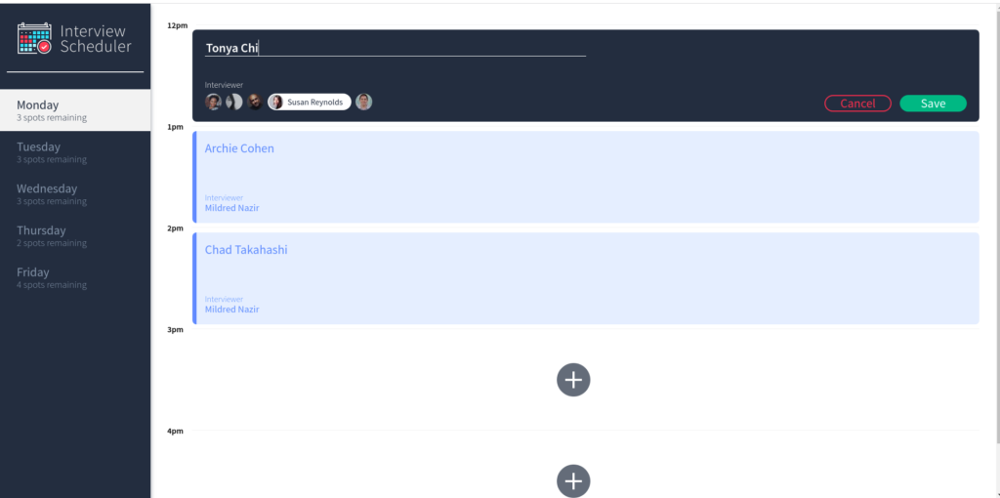
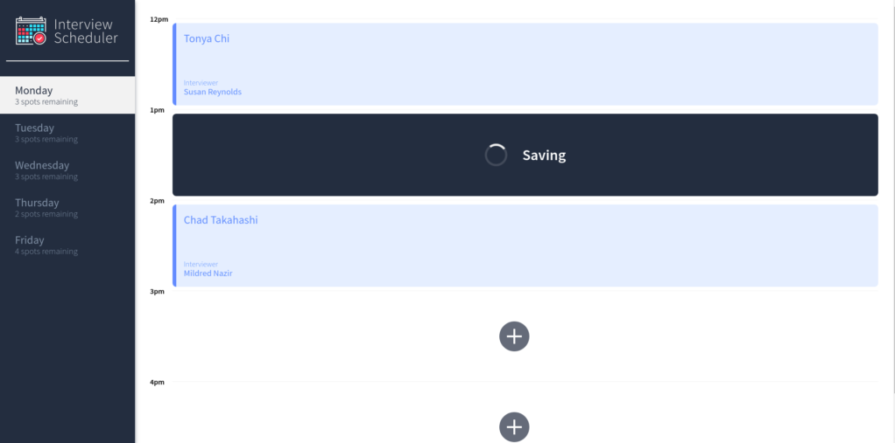
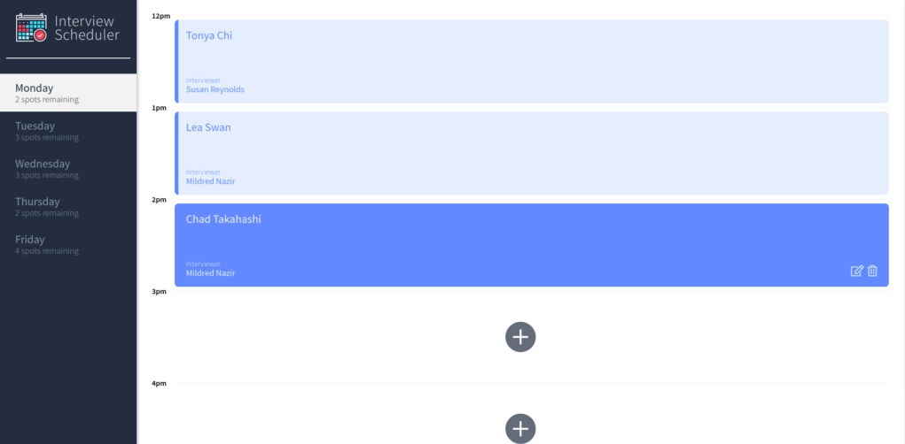
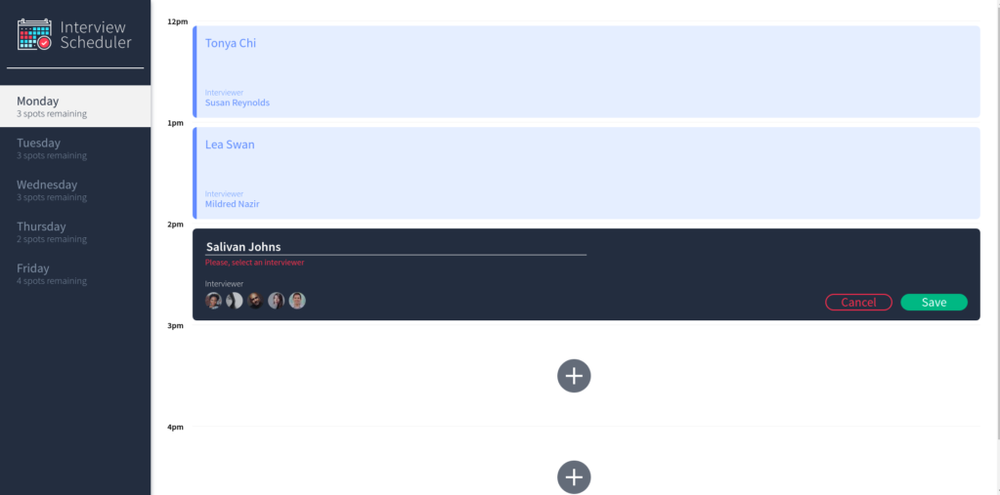
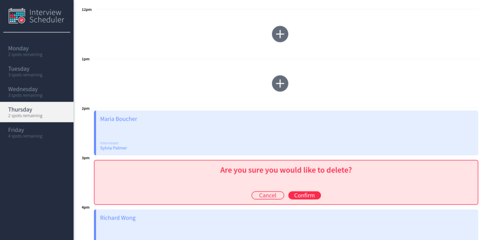
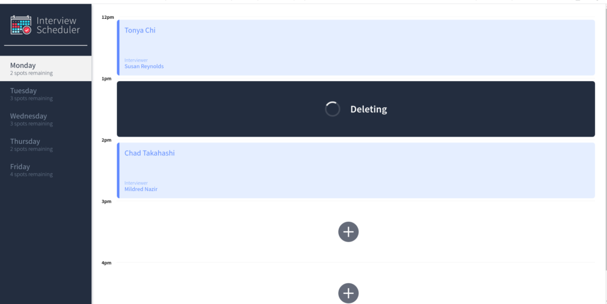

# Interview Scheduler
The Interview Scheduler is a SPA (single-page application) for tracking students interviews, built using React ⚛️. The user is allowed to create, edit and delete appointments in real-time.
The project was built using TDD (Test Driven Development) best practices where components were tested in isolation by using StoryBook and Cypress for End-to-End testing. Jest tests were used throughout the development of the project. 
Data is persisted by the API server using a PostgreSQL database. The client application communicates with an API server over HTTP,  using the JSON format.

# Screenshots
### Create an appointment



### Edit an appointment


#### Error if input for student name or interviewer is empty


<<<<<<< HEAD
=======

>>>>>>> 9e63197a469d4acc9930fb65970337ffdd30c2ca
### Delete an appointment




# Setup Instructions:
### To start you need to clone the repository to your side and follow the instructions.
### First, follow the instructions in README.md file in api-scheduler directory to set up your workflow.

### Install dependencies.
```sh
npm install
```

## Running Webpack Development Server
----------------------
### You need to run the api-server and react-project simultaneously. To do it you should open two terminals: one from scheduler and one from scheduler-api.

```sh
npm start
```

### If error occurred, check node version
#### The app is working on v10.16.1, change the node version.

```sh
node -v
nvm use v10.16.1
```

### Running Jest Test Framework

```sh
npm test
```

### Running Storybook Visual Testbed

```sh
npm run storybook
```

### Running Cypress on Test Framework

```sh
npm install -g cypress
npm run cypress
```

# Technical Specifications

- React ⚛️
- Webpack, Babel
- Axios, WebSockets
- Axios
<<<<<<< HEAD
- Storybook, Webpack Dev Server, Jest, Testing Library
=======
- Storybook, Webpack Dev Server, Jest, Testing Library
>>>>>>> 9e63197a469d4acc9930fb65970337ffdd30c2ca
